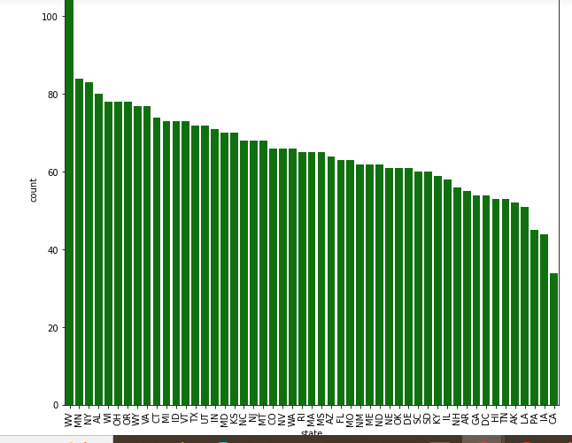
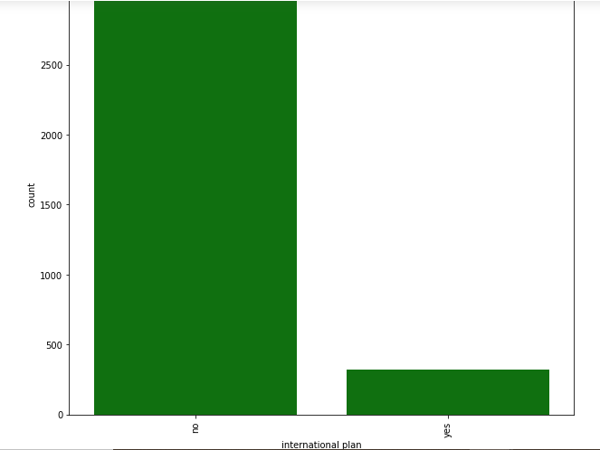
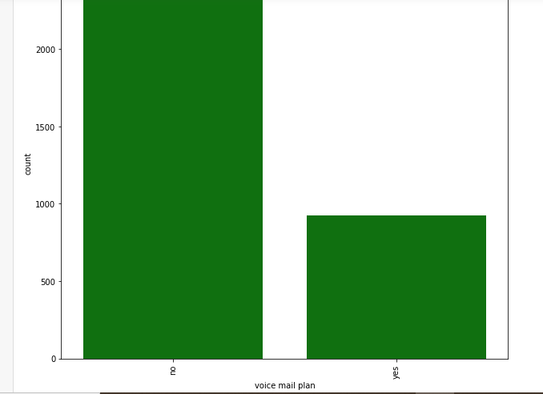
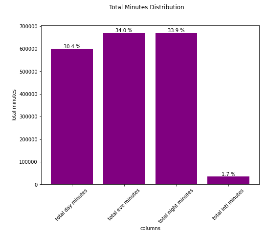
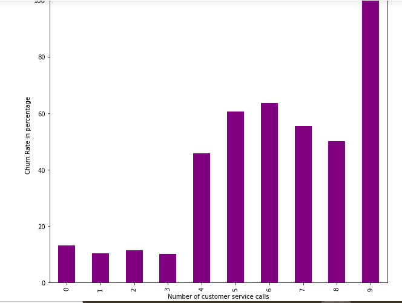
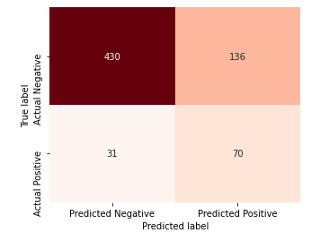
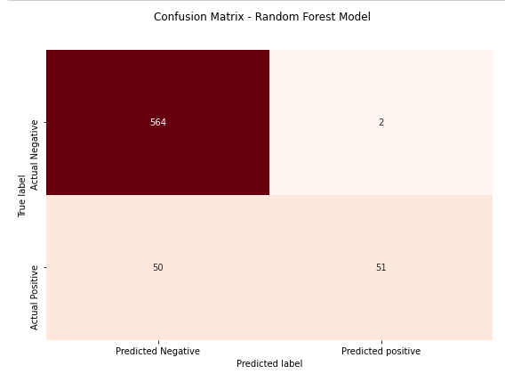
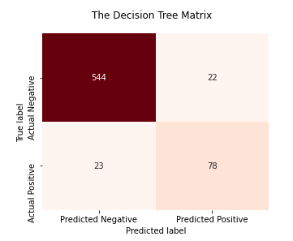
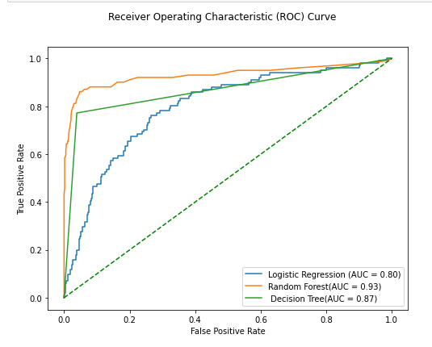

# Predicting Customer Churn in SyriaTel to Enhance Customer Retention

## Introduction
This project we will be working with the SyriaTel Customer churn dataset named as Customer_churn, to solve our business problem.
The Aim of this project is to analyse and determine how the SyrianTel company can reduce customer churn, retain customers leading to inceased profits.

## Business Understanding

#### Business problem
The SyriaTel Company is a telecomunication business that would  like to address the issue of custonwer churnig by creating a prediction model to understand why they are facing a high churn rate and their customers preferring their competitors. The main goal of SyriaTel Company is to reducing churn rate, increse customer retention hence increasing profitability 

## Objectives
1. Identify factors that may lead to customer churn

2. To create a model that will predict customer which are at a high risk of churning

3. The relevant steps that should be taken to retain customers

## Data Understanding

Data Understanding is essential for identifying patterns, ensuring quality and making informed decisions based on accurate analysis.

## Data Cleaning

We do data cleaning to remove any duplicates deal with missing values and any other inconsistencies

## Exploratory Data Analysis

Exploratory Data Analysis helps us identify the correlation between the features in the dataset and the distribution of the variables. This is essential for feature engineering and modelling.

### Univariate Analysis

This involves the distribution of each feature of the dataset in order to understand their characteristics and identify any issues such as outliers.

#### Churn Distribution

The churn column is our target variable and it is categorical. We will ude a pie chart to display its distribution.

0 is False
1 is True

The pie chart represents the distribution of customers who left(churned), vs those who stayed.
85.5% represents customers who did not churn 
14.5% represents customers who did churn, that is, they left the company

This imbalance suggests that customer retention is high, but the company should still analyse the reasons for churn to improve retention strategies.

#### Subscription plan distributions 

There are three categorical features as shown above; state, international plan, voice mail plan that we will be analysing.

#### distribution for the state column

#### Finding

Most of the consumers are from West Virginia, Minnesota, New York, Alabama, Wisconsin. 
while California has the list number of consumers.

#### International plan distribution

#### Finding

Only 323 customers have subscribed to the are  international plans out of 3333.

### Voice Main Plan Distribution

#### Finding

Only 922 customers have subscribed to the voive mail plan services out of 3333.

#### Conclusion
From the above distributions we can conclude that there are more subscribers of voice mail plan compared to the international plan subscribers.

#### Minutes Distribution

# define the column names
column_sum= [ 'total day minutes', 'total eve minutes', 'total night minutes', 'total intl minutes']

The above bar graph shows total minutes across different call categories.
The total evening minutes have the highest percentage compared to other call categories. This shows that most customers spend more time on calls in the evening. 

### Correlation of Features

Most features have low correlation with each other close to zero.

There is perfect positive correlations  between:

total eve charge and total eve minutes

total day charge and total day minutes

total night charge and total night minutes

total intl charge and total intl minutes

This is expected because call charges depend on call minutes.

### Customer Service Calls vs Churn

#### Finding

As the number of calls increases the rate of churn also increases. However after the sixth call the rate of churn is evident suggesting that more interactions could make customers more unhappy, causing more people to churn. 

#### Preparing  data for machine learning
1. One hot encoding
2. splitting the dataset in to the target(y) and features(x) 
3. standardizing
4. Checking for imbalance

### Data modelling

#### Logistic regression

###  Dealing with the imbalance

#### Logistic regression with class weights

We can adjust models to handle imbalance.

We will use Class weights to balance. This method assigns a higher weight on the minority class

# find the performance metrics
Accuracy: 0.7496251874062968
Precision: 0.33980582524271846
Recall: 0.693069306930693
F1_score: 0.4560260586319218
auc_lr: 0.7263933107091629

Confusion matrix

A higher number of true positives and true negatives indicates better performance , while the false positives or negatives highlight ares for improvement.

### Random Forest

 Since we are using Random Forest, we will balance the dataset this time by class weights

Random Forest Metrics:
Accuracy: 0.9220389805097451
Precision: 0.9622641509433962
Recall: 0.504950495049505
F1 score: 0.6623376623376623
ROC AUC Score: 0.7507084630724556
#### points to note

The Random Forest model has an accuracy score of 92.2%, meaning its is able to correctly classify instances.

The model has achieved a precision of 96.2% showing a high rate of correctly prediting churn instance out of all the predicted churn instances.

The Recall is 50.5% which suggests that the model captures about half of the actual churn instances.

The F1 score is 66.2% which represents the balance between precision and recall, indicating moderate performance.

The ROC AUC Score is 75.1% suggesting that the model performs reasonably well in disguishing between churn and non-churn instances.

### Confusion Matrix

#### points to note

-There is a high number of true negatives and true posistives, indicating good performance in predicting both non-churn and churn instances.

-There is a small number of false positives and false negatives, suggesting that the model has relatively low misclassification rates. 

### Decision Tree Model

# print performance metrics
Accuracy: 0.9325337331334332
Precision: 0.78
Recall: 0.7722772277227723
F1 Score: 0.7761194029850748
auc_dt 0.866703984886121
#### Interpretation

The accuracy achieved 93.3%  is higher than the accuracy of random forest and Logistic regression.

The precision achieved is 78% indicating a lower rate of false positives, compared to logistic regression which had about 51.5%

The recall is 77.2% suggesting that the model captures about 77.2% of the churn instances.

F1 score is 77.6% which show the balance between the recall and the precision.

### Confusion Matrix

The model above correctly identified 78 instances as positive 

It correctly classified 544 instatnces as negative(non_churn) outnof the actual negative instances.

There were 22 instances incorrectly classified as positive (False positives).

There are 23 instances incorrectly classified as negative(False negatives)

### AUC values of logistic regression, Random Forest and Decision Tree Model

The Random Forest curve displays the best.

### Model Evaluation

#### Logistic Regression

Accuracy: 0.75,
Precision: 0.34,
Recall: 0.69,
F1_score: 0.46,
auc_lr: 0.73.

Summary:The model has a decent overall accuracy of 75%, but struggles  with low precision, leading to relative;y low F1 score and precision

#### Random Forest

Accuracy:0.92, precison:0.96, Recall:0.50, F1 score:0.66, 

The model performs well with high accuracy and precision, but has a moderate recall, indicating missed true positives.

#### Decision Tree

Accuracy: 0.93, Precision:0.78, Recall:0.77, F1 score: 0.78

The model achieves high accuracy with a good balance between precision and recall
and strong AUC performance.
                

#### Summary on Model Evaluation

The decision tree is the best model since it gives the best accuracy and strong AUC

### Conclusion

-Desision Tree has emerged as our best model.

-West virginia has the highesrt number of customers while Califonia has the lowest number of customers.

-There are more total evening calls compared to the rest of the calls, meaning that the syria tel customers prefer evening calls.

-There are more subcriptions to voice mail plan than international plan.

-As the number of customer service call increases the number of churn increases. This shows that the customers experience negative customer service, where their issues are not solved leading to increase in customer churn.

### Recommendatations

-The best model to be used to predict customer churn is The Decision Tree Model, since, it has a good balance between precision and recall, identifying the positive class instances and minimizing the false negatives and false positivesand has a 92% accuracy hence can predict churn.

-Most customers neither have an international plan nor a voice mail plan. The SyriaTel company should consider promotion services to their customers by displaying the benefits hence attracting more.

-The SyriaTel Company should identify influential predictors and usage patterns identified by the model to develop retention strategies.

-The company should put in place systems and the qualified personnel for customer serve, in order to asolve the customers needs fast and efficiency to ensure satisfaction hence customer retention.

### Future Steps

The Decision Tree Model has good accuracy and performance, despite this the company should continue monitoring and evaluating its performance on new data. This is because customer behaviours and preferences shift over time hence ensure the model remains effective and up-to-date.